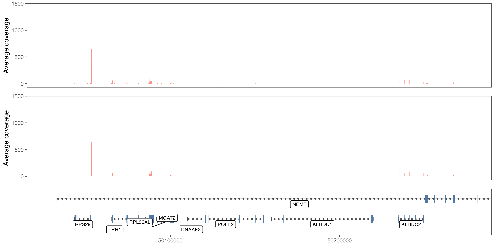

Visualise NGS Data Tracks
================
Federico Agostini

Getting Started
---------------

These instructions will get you a copy of the project up and running on your local machine for usage, development or testing purposes. See deployment for notes on how to deploy the project on a live system.

### Prerequisities

A pre-installed version of R (&gt;= 3.4.3), which can be downloaded from [here](https://cran.ma.imperial.ac.uk/) or [here](https://mirrors.ebi.ac.uk/CRAN/).

### Install from source

The aim of *devtools* is to make your life as a package developer easier by providing R functions that simplify many common tasks. *devtools* is opinionated about how to do package development, and requires that you use *roxygen2* for documentation:

``` r
require(devtools)
require(roxygen2)
```

Converts roxygen comments to *.Rd* files

``` r
roxygenise()
```

Builds a package file from package sources

``` r
build()
```

\[Optional\] Updates the documentation, then builds and checks the package

``` r
check()
```

Reinstalls the package, detaches the currently loaded version then reloads the new version with *library()*.

``` r
install()
```

### Install from repository

Install the *devtools* package and load it

``` r
install.packages("devtools")
library(devtools)
```

**\[Option 1\]** Use *install\_github("author/package")*. For example, with this fagostini/Kvasir package, which exists at github.com/fagostini/Kvasir

``` r
install_github("fagostini/Kvasir")
library(Kvasir)
```

**\[Option 2\]** Use *install.packages()*

``` r
install.packages(path_to_file, repos = NULL, type="source")
```

There's some extra fanciness that you need to do if the version you want sits on some branch of the repository, if the package is in a subdirectory of the main repository, or if the package is a private repository.

For example, to install a private repository you should provide the *install\_github()* with your authentication credentials.

``` r
install_github("fagostini/Kvasir", auth_user=username, password=password)
```

### To-Do

-   Merge annotation and data tracks (presently, the user has to merge the plots)
-   Add the option for differential track colours/fills
-   Improve the annotation (e.g. mark UTRs and coding/non-coding genes)

------------------------------------------------------------------------

Case study
----------

Human HNRNPC binding to a region on chromosomes 14.

### Setup

``` r
require("ggplot2")
require("cowplot")
require("ggthemes")
require("data.table")
require("GenomicFeatures")
require("rtracklayer")
require("zoo")

require("Kvasir")
```

    ## Warning: replacing previous import 'cowplot::theme_map' by 'ggthemes::theme_map'
    ## when loading 'Kvasir'

``` r
species = "Homo sapiens" # or 'Mus musculus' for mouse
genome = "hg19" # or hg38 or mm10 for mouse
version = "19" # or 27 or M14 for mouse
```

If any of the information above does not suit your needs, please review it in the 'setup' chunk.

### Gencode Annotation (GFF3)

If it not not present in the working folder, the pipeline will download the **Comprehensive gene annotation** from Gencode and create a local database.

``` r
if( require("TxDb.Hsapiens.UCSC.hg19.knownGene") ){
   TxDb = TxDb.Hsapiens.UCSC.hg19.knownGene
}else{
   TxDb = getTxDb(species, genome, version)
}
```

### Annotation track

Genic and exonic features are extracted from the database, ranked by size (larger on top) and distributed over different levels to prevent overlaps.

``` r
region = GRanges("chr14", IRanges(50027696, 50277302))

anno.pl = createAnnoTrack(TxDb, region, min.unit=width(region)/100, species)
```

    ## Check the annotation...

    ## Extract features...

    ## Apply layering...

    ## Create track data...

    ## Loading required package: org.Hs.eg.db

    ## 

    ## 'select()' returned 1:1 mapping between keys and columns

    ## Done

``` r
region.pl = as.data.table(region)

pl = plotAnno(anno.pl, range(region.pl[, list(start, end)]), addID=TRUE)
```


``` r
require("GenomicAlignments")
require("RNAseqData.HNRNPC.bam.chr14")

bamfiles = RNAseqData.HNRNPC.bam.chr14_BAMFILES[1:2]
param = ScanBamParam(tag="NM")
galp = lapply(bamfiles, function(x) suppressWarnings(readGAlignmentPairs(x, use.names=TRUE, param=param)))

ggl = createTracks(galp, region=region, use.smooth=FALSE)

ggl = plot_grid(plotlist=c(ggl, list(pl)), nrow=length(ggl)+1, axis="lr", align="v", rel_heights=c(rep((1-0.25)/length(ggl), length(ggl)), 0.25))
```


