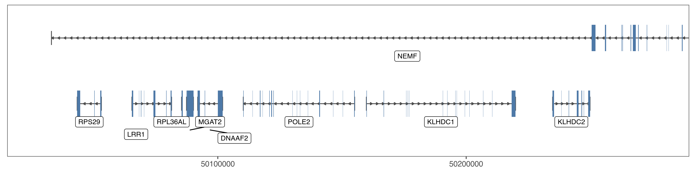

Visualise Gencode Tracks
================
Federico Agostini

## To-Do

  - Merge annotation and track plots
  - Add the option for differential track colours/fills
  - Improve the annotation (e.g., mark UTRs and coding/non-coding
    genes)

## Setup

    ## R version 3.4.3 (2017-11-30)

    ## Platform x86_64-apple-darwin15.6.0 (64-bit)

    ## Running under OS X El Capitan 10.11.6

    ## Last knitted on Fri Feb 16 11:14:51 2018

    ## Working directory set to /Users/agostif/Documents/GitHub/Visualise_Gencode_Tracks

    ## Species:  Mus musculus

    ## Genome assembly: mm10

    ## Gencode version: M14

If any of the information above does not suit your needs, please review
it in the ‘setup’ chunk and re-run the script.

### Case study

A region of ~90Kb covering the Xist gene locus is here used as example.

## Gencode Annotation (GFF3)

If it not not present in the working folder, the pipeline will download
the **Comprehensive gene annotation** from Gencode and create a local
database.

## Annotation track

Genic and exonic features are extracted from the database, ranked by
size (larger on top) and distributed over different levels to prevent
overlaps.

    ## quartz_off_screen 
    ##                 2

#### Figure 1: Annotation track visualisation

